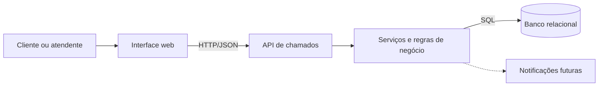
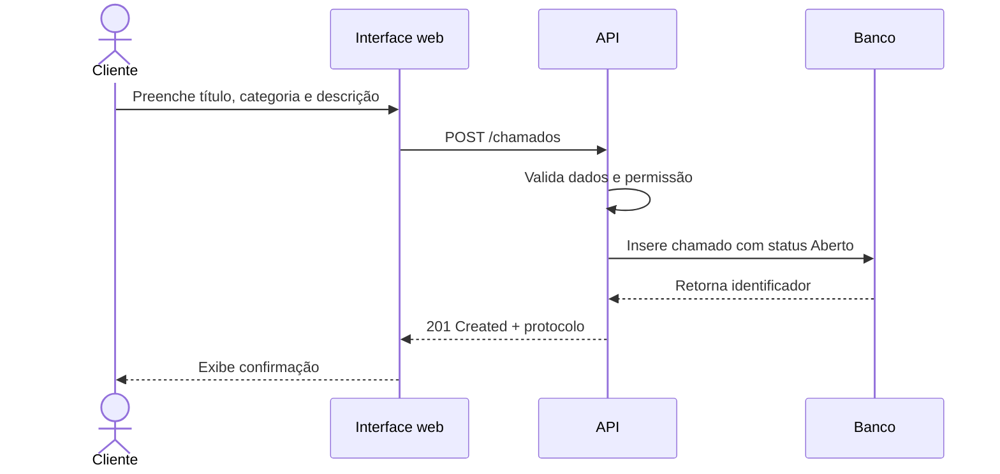

# Arquitetura do Sistema

## Visão geral

O sistema será organizado em três partes. O navegador cuida da interação, a API concentra validações e regras de negócio, e o banco relacional mantém os dados. A interface não acessa o banco diretamente.

## Responsabilidades

| Componente | Responsabilidade |
| --- | --- |
| Interface web | Exibir telas, validar campos simples, enviar requisições e apresentar respostas. |
| API | Autenticar, autorizar, validar dados, controlar status e expor os recursos do sistema. |
| Serviços | Executar o fluxo de atendimento sem depender da tela ou do banco. |
| Banco relacional | Persistir usuários, categorias, chamados e observações com integridade. |

## Dados principais

- **Usuário:** identidade, contato e perfil (`cliente` ou `atendente`).
- **Categoria:** nome e descrição usada na classificação do chamado.
- **Chamado:** título, descrição, status, categoria, cliente, atendente, datas de abertura e encerramento.
- **Observação:** texto, autor e data de cada atualização do atendimento.

## Regras de fronteira

- A interface pode validar formato e campos obrigatórios, mas não decide permissões.
- A API é a única responsável por aplicar regras de negócio e gravar datas de controle.
- O banco garante relacionamentos e persistência; não deve receber requisições do navegador.
- A API deve retornar erros claros para dados inválidos, falta de permissão e chamados inexistentes.

## Fluxo de abertura

## Evolução

O front-end pode ser substituído por outra interface, como um aplicativo mobile, desde que consuma o mesmo contrato da API. O serviço de notificações aparece como evolução porque não é necessário para o ciclo do MVP.